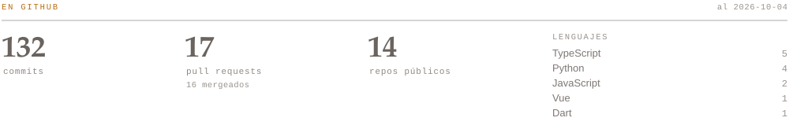
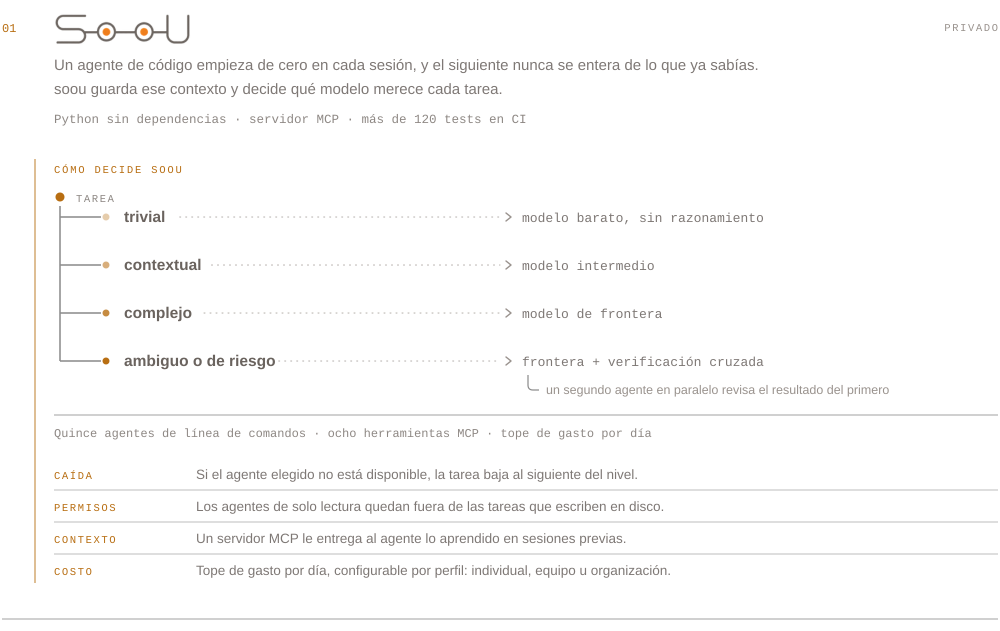
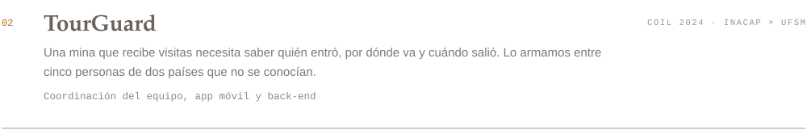
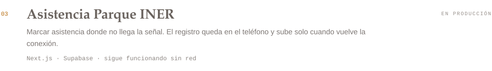

[English](README.md) · **Español**

[Email](mailto:lucas.alvarezsoto@gmail.com) · [Repositorios](https://github.com/LucasAlvarezS?tab=repositories) · [soou](#proyectos)

Hago producto de punta a punta: esquema en PostgreSQL, API, interfaz en Next.js y
TypeScript, y app en Flutter cuando tiene que funcionar en terreno sin señal.

En Python escribo herramientas. La última es soou: un servidor MCP y un orquestador
que decide qué agente y qué modelo recibe cada tarea, con más de 120 tests, CI y
cero dependencias de terceros.

Entreno modelos de detección con YOLOv8 y YOLOv11. Coordiné un equipo de cinco
entre Chile y Brasil durante un semestre. Titulado de INACAP.

## Proyectos

Todavía no es público. Si te interesa el detalle, escribime.

[Ficha del proyecto](https://coil-ufsm-inacap.github.io/2024/portfolio/group11/) ·
[demo](https://tourguard.onrender.com/) ·
[app móvil](https://github.com/LucasAlvarezS/miningtour-ff) ·
[API](https://github.com/pinhalgrandense/tour-guard-api)

[Demo](https://asistencia-parque-iner.vercel.app) ·
[código](https://github.com/LucasAlvarezS/asistencia-parque-iner)

---

Fuera de los agentes: TypeScript, Next.js, Python, PostgreSQL, Flutter y Vue.
Visión por computador con YOLOv8 y YOLOv11.
