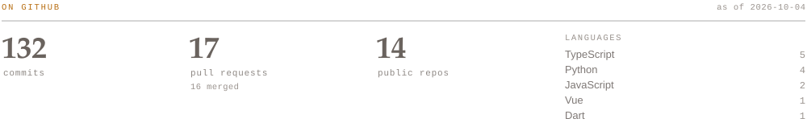
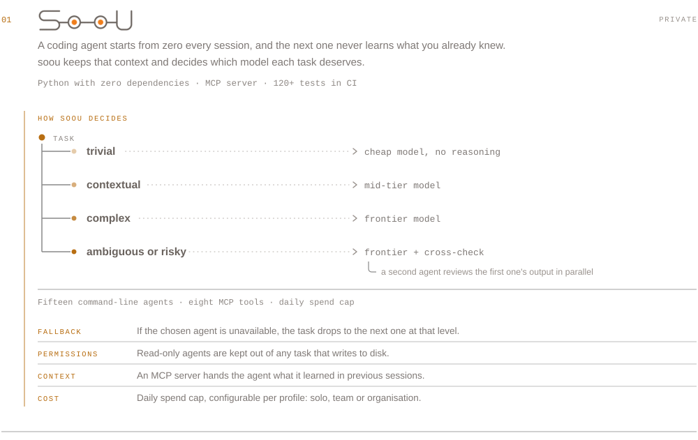
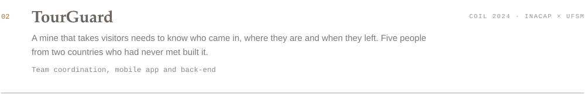
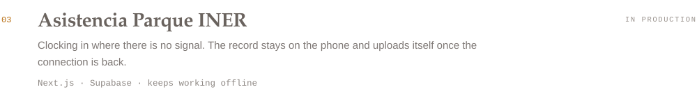

**English** · [Español](README.es.md)

[Email](mailto:lucas.alvarezsoto@gmail.com) · [Repositories](https://github.com/LucasAlvarezS?tab=repositories) · [soou](#projects)

I build products end to end: PostgreSQL schema, API, a Next.js and TypeScript
interface, and a Flutter app when it has to work in the field with no signal.

In Python I write tools. The latest one is soou: an MCP server and an orchestrator
that decides which agent and which model each task gets, with 120+ tests, CI and
zero third-party dependencies.

I train detection models with YOLOv8 and YOLOv11. I coordinated a five-person team
across Chile and Brazil for a semester. INACAP graduate.

## Projects

Not public yet. If you want the detail, write to me.

[Project page](https://coil-ufsm-inacap.github.io/2024/portfolio/group11/) ·
[demo](https://tourguard.onrender.com/) ·
[mobile app](https://github.com/LucasAlvarezS/miningtour-ff) ·
[API](https://github.com/pinhalgrandense/tour-guard-api)

[Demo](https://asistencia-parque-iner.vercel.app) ·
[code](https://github.com/LucasAlvarezS/asistencia-parque-iner)

---

Outside the agents: TypeScript, Next.js, Python, PostgreSQL, Flutter and Vue.
Computer vision with YOLOv8 and YOLOv11.
